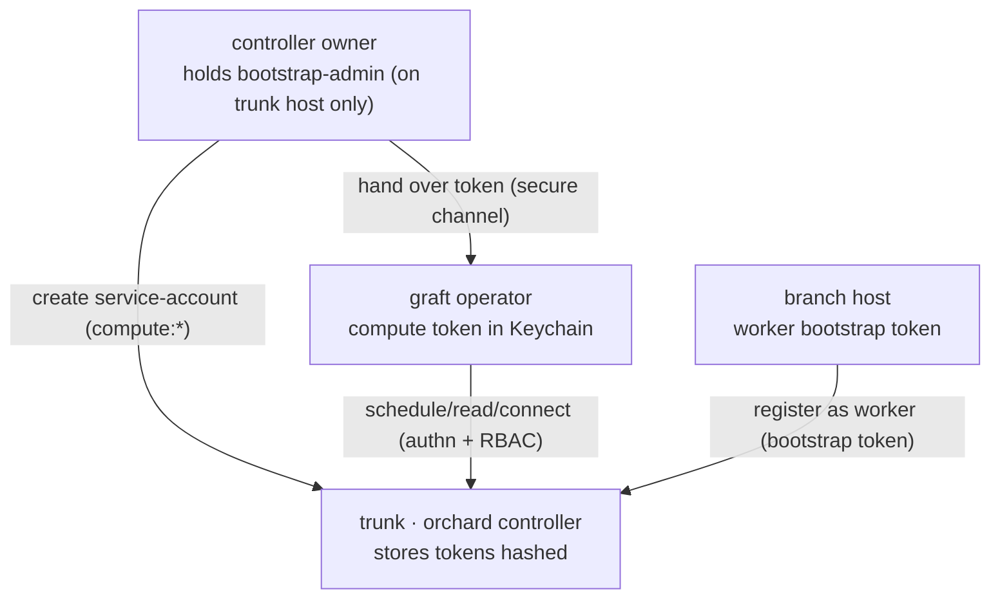

# graft — Remote Control Plane: Host Management, Health & Security

> Working design doc. Defines how graft grows from a **single-host tool** into something
> that can **reach, control, and observe the Macs that run a fleet** (the trunk + branch
> hosts) from one place — start/stop/restart, status, logs — plus a **health panel** that
> aggregates events from everywhere. Weighs the transport options (SSH+launchd vs. a
> per-host agent), and treats **security as a first-class design input**, not an
> afterthought — because the moment hosts separate, credential distribution and remote
> code execution become the whole ballgame. Marks **current** behavior vs. the **target**
> ("should"). Will seed a Linear epic (GFT-TBD).

---

## 0. Design principles (the rules everything below obeys)

1. **The user's machine is the most-trusted node; the runner VM is the least.** Trust
   *decreases* outward: control Mac → controller host → branch host → leaf. Every design
   choice should respect that gradient and never invert it (e.g. don't put the most
   powerful credential on the least-trusted node).
2. **Least privilege, always.** Every credential, role, sudoers entry, and API verb is
   the smallest that works. A graft supervisor gets `compute:*`, not admin. An agent
   exposes *enumerated actions*, never arbitrary exec.
3. **Reuse mature, audited machinery before inventing.** SSH and launchd are decades-hardened.
   A new network daemon is new attack surface *we* now own and must secure. Prefer the
   boring, proven substrate unless it genuinely can't do the job.
4. **No new secrets in graft's own storage.** Lean on the Keychain (and Secure Enclave /
   ssh-agent) that already exist. graft should *use* credentials, not hoard copies.
5. **All output from a runner is untrusted data, not commands.** CI runs attacker-influenced
   code. Logs, status, and metrics flowing back are *data* to be sanitized and rendered
   safely — never interpreted, never trusted to be well-formed.
6. **Destructive + outward actions confirm, and are audited.** Rebooting a host, pruning
   leaves, rotating a token — each is reversible-with-effort at best. Confirm in the UI,
   log who-did-what-when.
7. **Blast radius is a feature.** Ephemeral leaves, per-host credentials, scoped roles:
   the goal is that compromise of *one* node doesn't hand over the *fleet*.

---

## 1. The problem & the gap

graft today is **single-host-shaped**. `graft tree plant` / `branch` / `prune`,
`arborist tend` — all run *on the machine you're sitting at*. The GUI manages the **local**
supervisor and *reads* the Orchard fleet (the Canopy view). There is **no way to
reach another Mac and control graft's processes on it.**

What's missing, concretely:

- **No host inventory.** graft has no notion of "the Macs that make up my fleet" — only
  what Orchard happens to report as workers (which carries no SSH address, no lifecycle
  control).
- **No remote process control.** You can't start/stop/restart a trunk or branch on
  another host, or reboot the host, from anywhere but that host's own keyboard.
- **No aggregated health.** `HealthMonitor` / `HealthEvent` / `EventSink` exist, but events
  live **inside each supervisor process, locally.** "Collect everything streamed from
  everywhere" needs a transport that does not yet exist.

Orchard is **not** the answer to this: it's a control plane for *VMs and scheduling*, not
for the *host processes* (controller/worker daemons) or the *machines*. It can tell you a
worker exists; it cannot start that worker's daemon or reboot its Mac.

So this epic is about building the layer that doesn't exist: a **control plane for the
hosts**, plus the **transport** to observe them.

---

## 2. Goals / non-goals

**Goals**

- A **host inventory** ("Grounds"): the Macs in a fleet and how to reach them.
- **Remote lifecycle**: start / stop / restart a trunk or branch; status; tail logs;
  (guarded) reboot the host — from the GUI/CLI, against any host.
- **Service-ified** trunk/branch (launchd) so lifecycle is robust (survives logout,
  auto-restarts) and remotely addressable.
- **Aggregated health** ("Sapflow"): one panel collecting health/events from every host.
- A **security model** good enough to actually deploy across machines: credential tiers,
  distribution, rotation, and a real threat model per transport.

**Non-goals (for this epic)**

- Multi-controller / HA Orchard. The trunk stays a single point of truth (see the
  lifecycle doc); we tolerate its blips, we don't replicate it.
- A general remote-shell / RMM product. graft controls *graft's* processes and the host,
  via **enumerated** actions — not arbitrary command execution.
- Replacing Orchard's own auth. We build *on* its service-account model, not around it.

---

## 3. Concepts

### 3.1 Grounds (host inventory)

A **ground** is a Mac that participates in the fleet, with a role and a way to reach it:

```
ground:
  name:    "studio-1"
  address: "studio-1.local"        # ssh host (or IP)
  user:    "ci"
  roles:   [trunk]                 # or [branch], or both
  # transport-specific bits (ssh key alias, agent endpoint) live here
```

Inventory is **explicit**, not discovered — discovery (mDNS/Bonjour) is spoofable and
deferred (§6.4). The inventory is config, not secret; it carries *no* tokens.

### 3.2 The credential tiers (the part that's obvious now and easy to get wrong later)

The single-host setup hides this because **you play every role at once**. Distributed,
there are **three distinct credential tiers**, and conflating them is the classic mistake:

| Tier | Who holds it | Where it lives | Grants | Must NOT leave |
|---|---|---|---|---|
| **bootstrap-admin** | the controller's owner | the **trunk host** (`~/.orchard/admin-token.txt`) | create/delete service accounts | the trunk host |
| **service-account token** (`compute:read/write/connect`) | each graft **operator** | the operator's **Keychain** | schedule/read/connect leaves | that operator's machine |
| **worker bootstrap token** | each **branch** host | that branch host | register a worker with the trunk | that branch host |

Plus the cross-cutting **GitHub App private key** (§6.1) — orthogonal to Orchard, but the
single highest-value secret graft touches.

**The cardinal rule: the bootstrap-admin token stays on the trunk host.** Today's
single-host shortcut reads it off local disk to auto-create the `graft` account — fine when
the admin *is* the operator *is* the trunk. **Replicating that file onto client machines
would be a critical mistake**: it would hand every operator the power to mint/delete any
account. In a distributed setup, account creation happens *on the trunk* (by its owner),
and operators receive only their scoped `compute:*` token.



### 3.3 What a token actually does (so the model is unambiguous)

Orchard does real **authentication + RBAC**. Every call carries an account name + token:

- wrong/missing token → **401**. The controller stores the token **hashed** (so it can
  verify but never *reproduce* it — which is why a lost token is regenerated, not
  recovered).
- valid token, insufficient role → **403**. Roles map 1:1 to graft's actions:
  `compute:read` → list/get (the canopy), `compute:write` → create/delete leaves,
  `compute:connect` → exec into a leaf.

A token is a **bearer credential with no intrinsic identity** — nothing is bound to the
specific bytes. A freshly minted token is fully equivalent to the old one; rotation =
delete + recreate. (This is exactly what `graft init`'s `ensureOrchardToken` does.)

---

## 4. Transport approaches

The core fork: **how does the control machine reach and command another host?**

| | **SSH + launchd** | **graftd agent** | **Hybrid (recommended path)** |
|---|---|---|---|
| What | Service-ify trunk/branch as launchd jobs; drive over SSH (`launchctl kickstart/bootout`, `reboot`); pull health over SSH | A small per-host daemon exposing an authenticated API for control + streamed health | Ship SSH+launchd first; evolve to an agent where streaming/scale demand it |
| New attack surface | **Minimal** — no new listener; leans on SSH (mature, audited) | **Large** — a network daemon graft owns and must secure (authn, RCE, transport) | Phased; pay the agent cost only when justified |
| Real-time health | Poll-over-SSH (seconds latency) | True streaming | Poll now, stream later |
| Auth | SSH keys (ideally Secure-Enclave / hardware-backed), host-key pinning | mTLS / signed tokens | SSH now |
| Linux fit | SSH+systemd is the same shape | the agent is the natural seam for non-Mac hosts | both |
| Cost | Low | High (multi-week: daemon, auth, discovery, packaging, updates) | Incremental |

**Recommendation: hybrid, SSH+launchd first.** It delivers ~all the control-plane value
with the *smallest new attack surface* — counterintuitively the *more* secure default,
because we're not writing a new authenticated network daemon. The agent earns its place
later, when real-time streaming or fleet scale demands it (and it's the clean seam where
**Linux worker hosts** plug in — see the portability notes).

---

## 5. Health aggregation ("Sapflow")

graft already has the bones — `HealthMonitor`, `HealthEvent`, `EventSink` — but events are
**local to each supervisor process**. Aggregation needs a **transport**:

- **Phase 1 (SSH-pull):** each host's supervisor writes health to a local sink (file /
  status endpoint on loopback); the control machine pulls + merges on a timer. Cheap,
  unified panel, seconds-fresh.
- **Phase 2 (agent-push / stream):** the agent streams events to the collector in
  real time. No SSH-per-poll.

**Security caveats specific to health:** events may carry sensitive substrings (URLs,
names, *never* tokens — enforce scrubbing in `HealthEvent`). Treat all runner-originated
log content as untrusted: **sanitize/escape before render** (a malicious job can emit
crafted lines / terminal escapes to spoof state or attack the dashboard — same
instruction-vs-data boundary that governs the rest of graft). The collector is itself a
listening surface (§6.4) and inherits those concerns.

---

## 6. Security & threat model

This is the section that decides whether any of the above is deployable. Organized as:
assets → trust boundaries → per-surface vulnerabilities (what, *why it exists*, how it's
mitigated).

### 6.1 Assets (what we're protecting, worst → least)

1. **GitHub App private key.** The crown jewel: with it an attacker mints installation
   tokens + JIT runner configs → can register runners and influence CI. *Why it exists:*
   graft must register runners. *Protections:* stored in the **Keychain** (never on disk;
   the manifest-create flow means it never touches disk at all), ACL **bound to the binary
   signature**, never logged; **least-privilege App permissions** (repo *Administration* /
   org *Self-hosted runners* only — no code/secrets read); **short-lived JWTs** (~8 min);
   `login` vs `system` keychain scoping for daemons.
2. **bootstrap-admin token.** Can create/delete any Orchard account → full fleet control.
   *Protection:* **stays on the trunk host**, never distributed (§3.2).
3. **service-account tokens (`compute:*`).** Schedule/read/connect leaves. *Protection:*
   per-operator, in Keychain, scoped roles, hashed on the controller, rotatable.
4. **SSH / agent credentials to the hosts.** Control over the host processes and machines.
   (§6.3 / §6.4.)
5. **The control machine itself.** Aggregates access to everything — a crown-jewel *node*.
6. **Runner VMs (leaves).** Run untrusted CI code; ephemeral by design to bound blast
   radius.

### 6.2 Trust boundaries

- **leaf ↔ host** — VM-escape boundary. Leaves run attacker-influenced code; isolation is
  Tart/Virtualization.framework, and **ephemerality** (one job, then destroyed) means no
  state reuse between jobs.
- **host ↔ control plane** — remote-control boundary. The whole of §6.3/§6.4.
- **control machine ↔ everything** — its compromise = fleet compromise; hence FileVault,
  hardware-backed keys, patched, MFA.
- **GitHub ↔ graft** — the App-key boundary (§6.1).

### 6.3 Credential distribution & rotation (the thing to get right)

- **Distribution is out-of-band and the admin's job.** The trunk owner mints a scoped
  `compute:*` token and hands it to an operator over a **secure channel** — never a public
  repo, never plaintext Slack/email, never a URL parameter. The recipient stores it in
  their **own** Keychain; the profile JSON only references the *account name*, never the
  token.
- **Rotation = delete + recreate.** Tokens are hashed on the controller and bearer-only, so
  there's no "retrieve"; rotating is `orchard delete service-account X` → `create … --token
  <new>` → update the holder's Keychain. Cheap and equivalent.
- **Revocation** is the same delete. A compromised operator token is killed by deleting the
  account; other operators (separate accounts) are unaffected — *which is the argument for
  per-operator accounts, not one shared token.*
- **Admin token never leaves the trunk.** Restated because it's the easiest line to cross:
  the single-host convenience of reading `~/.orchard/admin-token.txt` must **not** be
  generalized to clients. GUI/CLI account-creation against a *remote* trunk requires the
  operator to already have an admin context *on that trunk* — otherwise they paste a token
  an admin made for them.
- **The GUI stores tokens; it never mints them.** Minting a service account is an *admin*
  operation (needs bootstrap-admin) and belongs exclusively to the trunk host's owner —
  done there via CLI (`graft init` / `orchard create service-account`). The app is an
  *operator* tool: its only Orchard-credential affordance is "paste the token your admin
  gave you" (`Set token…`). We deliberately do **not** add a "create on trunk" button —
  even in the local single-host case where it'd technically work, because that would
  normalize depending on an on-disk admin token, the exact pattern we're keeping contained.
  (Capability follows trust: operator tools get operator powers.)

### 6.4 Per-surface vulnerabilities (what · why · mitigation)

**SSH + launchd**

- **SSH key theft / over-broad keys** — a key that grants shell on every host means the
  control Mac's compromise ≈ fleet root. *Why:* SSH keys are the auth. *Mitigation:* use
  the user's **ssh-agent** (graft never stores keys), **per-host keys** (not one shared
  key), passphrase- or **hardware-backed** keys (Secure Enclave / YubiKey), key-only auth
  (no passwords).
- **Host-key / MITM** — skipping host-key verification lets a network attacker impersonate
  a host and capture/inject commands. *Why:* convenience for dynamic hosts. *Mitigation:*
  **pin host keys**, verify on first connect, never silently auto-accept.
- **Command injection** — building SSH command strings from inventory fields
  (hostnames, profile names) invites injection. *Why:* shelling with string interpolation.
  *Mitigation:* pass **args as arrays**, validate inventory fields, no `bash -c
  "…interpolated…"`.
- **Privilege escalation via reboot/sudo** — "restart the host" needs reboot rights;
  blanket passwordless sudo widens the door. *Mitigation:* prefer **user-level launchd
  agents** (no sudo) where possible; if root daemons are needed, scope sudoers to exactly
  `launchctl`/`reboot`; confirm destructive actions.
- **launchd plist tampering / persistence** — a writable plist is a boot-time code-exec
  foothold. *Mitigation:* install plists with correct ownership/permissions (launchd
  **refuses world-writable** plists), validated program paths.
- **Lateral movement** — SSH to all hosts means one key reaches everything. *Mitigation:*
  per-host keys + network segmentation; only the control plane holds broad access.

**graftd agent**

- **The agent is a listening daemon = new RCE surface.** Any request-handling, auth-bypass,
  or deserialization bug → remote code exec on a fleet host. *Why:* it listens.
  *Mitigation:* **minimal, enumerated API** (start/stop/restart/status only — *no*
  arbitrary-exec endpoint), memory-safe Swift, strict input validation, run least-privilege.
- **Weak authn/authz** — anyone who can reach the API controls the host. *Mitigation:*
  **mTLS** (client certs) or signed tokens; consider binding to loopback + reaching via SSH
  tunnel (defense in depth — though that collapses toward "just use SSH", which is the
  point); per-agent identity, rotation.
- **Plaintext transport** — eavesdrop + tamper. *Mitigation:* TLS, **pinned certs**.
- **Confused deputy** — a request tricking the privileged agent into doing more than
  intended. *Mitigation:* enumerated actions, no passthrough shell, explicit authorization
  per verb.
- **Agent update channel** — pushing updates to all hosts is a fleet-wide code path; hijack
  = fleet compromise. *Mitigation:* **signed releases**, verified updates, controlled
  rollout. (This is precisely a supply-chain risk — treat it like one.)
- **Spoofed discovery** — auto-discovery (mDNS) lets an attacker advertise a rogue agent.
  *Mitigation:* **explicit inventory over discovery**; authenticated identity (cert
  pinning).
- **Secret concentration** — an agent that reads the Keychain to manage the supervisor
  concentrates secrets. *Mitigation:* the agent shouldn't need the GitHub key (the
  *supervisor it launches* reads it) — separation of duties.

**Health transport**

- **Exfiltration / integrity** — streaming "everywhere" widens exposure of log data.
  *Mitigation:* **scrub secrets** at the `HealthEvent` source, TLS in transit, authn on the
  collector.
- **Log injection / poisoning** — a malicious runner emits crafted lines (spoofed health,
  terminal escapes). *Mitigation:* **sanitize/escape on render**; runner output is untrusted
  data (principle 5).

### 6.5 Cross-cutting principles (the short list)

Least privilege · no secrets in graft's own storage (Keychain / Secure Enclave / ssh-agent)
· authenticated + encrypted transport with pinning · **enumerated actions, never arbitrary
remote exec** · ephemerality as blast-radius control · all runner output is untrusted ·
confirm + **audit** destructive/outward actions · per-node credentials so one compromise
isn't fleet-wide.

---

## 7. Phasing

- **Phase A — service-ify + inventory.** `graft tree plant/branch --install` (launchd
  jobs); a Grounds inventory (config). No remote yet — make lifecycle robust + addressable.
- **Phase B — SSH host control.** Grounds panel: status / start / stop / restart / tail
  logs over SSH (host-key pinned, ssh-agent, arg-array exec). Guarded reboot.
- **Phase C — Sapflow (pull).** Aggregate health from each host over SSH into one panel.
- **Phase D — graftd agent (if/when justified).** Streaming + enumerated control over
  mTLS; the seam for Linux hosts. Decide to build this only when Phase A–C limits bite.

Each phase is independently shippable and independently valuable.

---

## 8. Linux fit

This control plane is also where **Linux** stops being hypothetical. SSH+systemd is the
same shape as SSH+launchd; a `graftd` agent is the natural home for a non-Mac
`VMProvider`/worker. The seams already identified (VMProvider, SecretStore,
JITConfigProvider) compose with this: a Linux *worker host* becomes "a ground with a
systemd unit instead of a launchd job." Nothing here should hard-code macOS assumptions
into the *control* layer (keep launchd-vs-systemd behind a small host-ops abstraction).

---

## 9. Open questions

1. **launchd: user-agent vs root-daemon** for trunk/branch? (No-sudo user agents are safer
   but die with the session unless configured otherwise.)
2. **Inventory source of truth** — standalone Grounds config, or derive branch hosts from
   the Orchard worker registry + an address overlay?
3. **Health sink format** for Phase C — file tail vs a loopback status endpoint each host
   exposes?
4. **Does an in-flight job survive a controller blip?** (Carried from the lifecycle doc —
   Orchard has no HA; bears on how aggressively the control plane may restart a trunk.)
5. **Agent identity bootstrapping** (Phase D) — how does a new host get its client cert
   without a chicken-and-egg trust problem? (Likely: SSH-bootstrap the cert.)

---

## 10. Backlog (to seed in Linear — GFT-TBD)

- Epic: **Remote control plane** (this doc).
- `--install` launchd service-ification of trunk/branch (Phase A).
- Grounds inventory model + GUI section ("Grounds"/Hosts) (Phase A/B).
- SSH host-ops: status/start/stop/restart/logs, host-key pinning, arg-array exec (Phase B).
- Guarded host reboot (Phase B).
- Sapflow health aggregation, pull transport (Phase C).
- `graftd` agent spike: mTLS, enumerated API, streaming (Phase D, gated).
- Security: per-operator account guidance + rotation/revocation UX; ensure admin token
  never distributed; HealthEvent secret-scrubbing audit.
