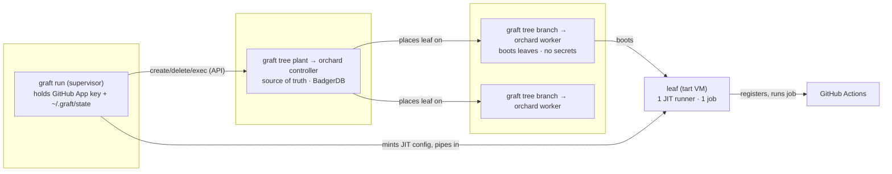
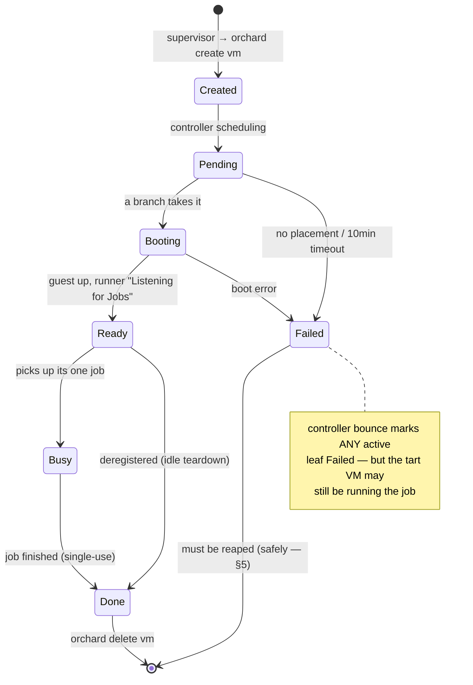
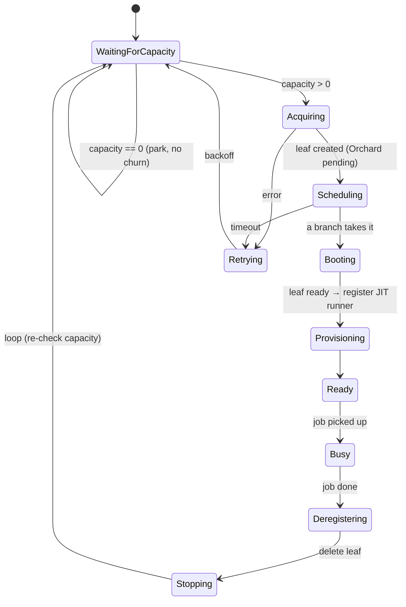
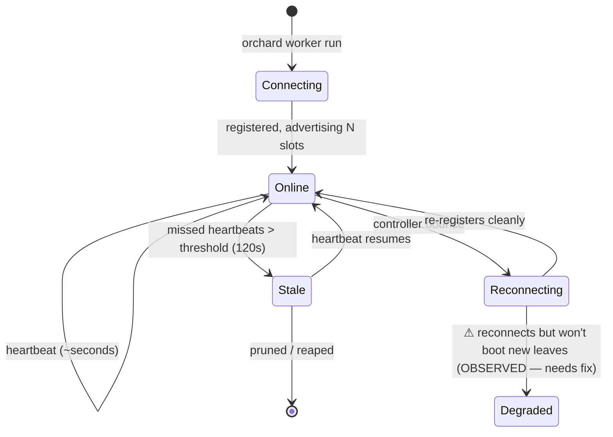
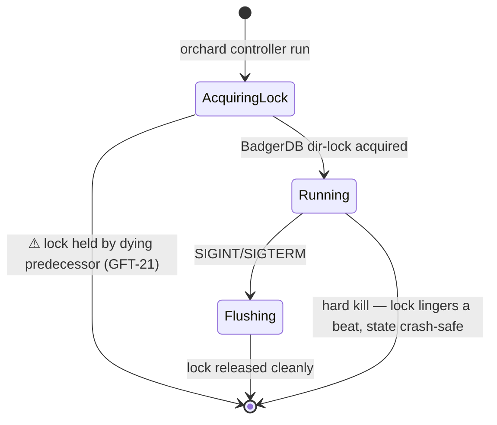
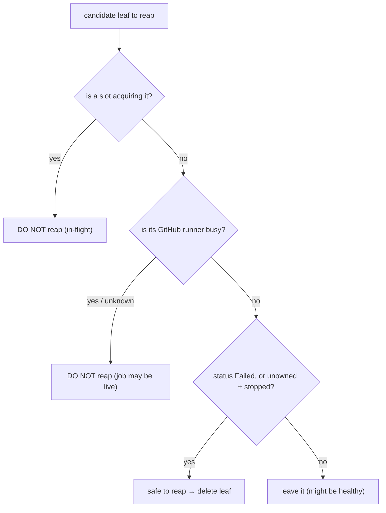
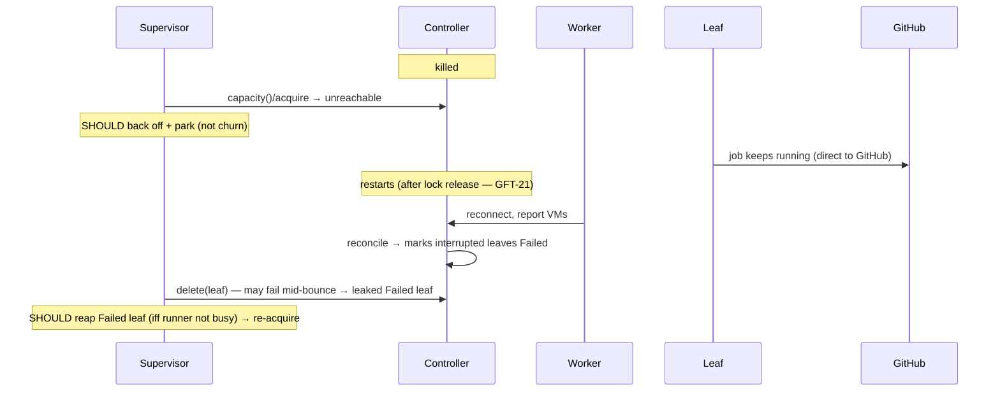
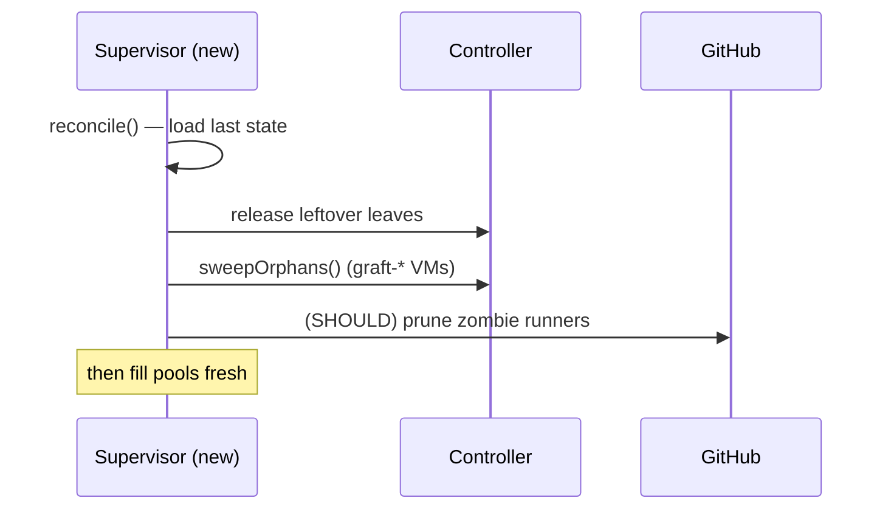

# graft — Lifecycle, State & Failure Design

> Working design doc. Defines every component's lifecycle, **what happens on shutdown /
> restart** (what tears down, what persists, what happens when it comes back), every
> failure ordering, and how "stuck stuff" (deadwood, orphan / failed / pending leaves,
> ghost workers, zombie runners) is cleaned up **safely**. Marks **current** behavior vs.
> the **target** ("should"). Drives the backlog: GFT-17 (remediator), GFT-18 (elastic),
> GFT-20 (deadwood false-positive), GFT-21 (controller lock).

---

## 0. Design principles (the rules everything below obeys)

1. **Leaves are cattle, not pets.** A leaf runs exactly one job, then dies. On *any*
   disruption you **replace, never resume** — the JIT runner config is single-use anyway.
2. **The controller is the single source of truth — and a single point of failure.**
   Orchard has no HA (single instance, local BadgerDB). So: minimize its downtime
   (supervise + auto-restart), and make every other component **tolerate a blip** instead
   of cascade-failing.
3. **Cleanup must be safe.** Never destroy something that might be doing real work.
   `failed`/`disconnected` ≠ `idle`. The hard part of healing is the *restraint*.
4. **Each component cleans up after itself on graceful shutdown.** The monitor / remediator
   only handles leftovers from *un*graceful events (crashes, kills, partitions).
5. **Detect first, heal second, opt-in only.** Detection is always-on; remediation is
   deliberate, guarded, never default.
6. **A job's truth lives on GitHub, not in graft.** The runner talks to GitHub directly,
   so "graft lost the leaf" ≠ "the job failed."

---

## 1. Components, ownership & secrets



| Component | Command | Owns | Secrets | Persistent state | Source of truth for |
|---|---|---|---|---|---|
| **Supervisor** | `graft run` | desired runner count, JIT registration | **GitHub App PEM** | `~/.graft/state/pool.json` | what graft *wants* |
| **Controller** (trunk) | `graft tree plant` | scheduling, VM/worker registry | none | `~/.orchard/controller` (BadgerDB) | what *exists* cluster-wide |
| **Worker** (branch) | `graft tree branch` | the host's tart VMs, advertised capacity | **none** | tart VMs on local disk | what's *actually booted* on its host |
| **Leaf** (VM) | — | one ephemeral runner | the single-use JIT token | — | one job |
| **Monitor** | `--tend` | nothing — observes | none | `~/.graft/logs`, `state/health.json` | — |

**Cleanup ownership is the crux.** Normally the **supervisor** destroys a leaf (it created
the demand). When a failure severs that ownership, *nobody* owns the cleanup — that's where
deadwood comes from (§5).

---

## 2. State machines

### 2.1 Leaf (VM)



### 2.2 Slot (the supervisor's unit of demand — one per desired runner)



### 2.3 Worker (branch)



### 2.4 Controller (trunk)



---

## 3. Shutdown & restart semantics — what tears down, what stays

The part that matters most. For each component: **graceful** (SIGINT), **hard kill**, and
**restart**.

### Controller (trunk)
| | Behavior |
|---|---|
| **Graceful** | Flush BadgerDB, release the dir lock. **Persists:** entire registry (workers, VMs, accounts). **Tears down:** nothing — it owns no VMs. Leaves keep running on workers. |
| **Hard kill** | BadgerDB is crash-safe; lock lingers briefly (**GFT-21** → next plant fails first try). |
| **Restart** | Reloads registry → workers reconnect → **reconciles**: marks interrupted leaves `Failed`. *Should:* re-adopt still-running leaves where possible; today it fails them. |

### Worker (branch)
| | Behavior — **current** | **Should** |
|---|---|---|
| **Graceful** | Exits; **leaves its tart VMs running** (stranded) | **Drain**: stop taking new leaves, let in-flight jobs finish, then destroy its leaves and exit |
| **Hard kill** | tart VMs persist on disk (stranded); controller shows worker as ghost until stale | branch agent (`tree branch --tend`) flags stranded `orchard-graft-*` VMs (built); remediator reaps them |
| **Restart** | Re-registers; does **not** reclaim its old stranded VMs | Re-register **and** reconcile local tart VMs against the controller — destroy any the controller doesn't know about |

### Supervisor (`graft run`)
| | Behavior |
|---|---|
| **Graceful** | `cleanup()`: deregister runners from GitHub, delete all its leaves, clear state. **Tears down:** every leaf + registration it owns. |
| **Hard kill** | Leaves + runner registrations **leak**. `~/.graft/state` holds the last snapshot. |
| **Restart** | `reconcile()`: load state → release leftover leaves → `sweepOrphans()`. *Should also:* reap `Failed` leaves and reconcile against the live controller, not just the last snapshot. |

### Leaf (VM)
Ephemeral by definition. Graceful: destroyed after its one job. On supervisor/worker/
controller disruption: **replace, don't resume**. The only nuance is **don't delete a leaf
whose job is still running** (§5).

---

## 4. Failure-mode matrix

Every ordering, **now** vs **should**, who **detects**, who **recovers**.

| # | Scenario | What happens **now** | What **should** happen | Detected by | Recovered by |
|---|---|---|---|---|---|
| 1 | `graft run` starts, **can't reach controller** | `capacity()` falls back to `maxVMs` (>0) → tries to acquire → fails → retry churn | Back off; park in `WaitingForCapacity`; **don't churn** | `controller-unreachable` (critical) | self, when controller returns |
| 2 | **Controller dies** while leaves idle/busy | leaves → `Failed`; supervisor's `delete` may fail mid-outage → **leaked failed leaves** | leaves replaced; failed ones reaped (only if not busy) | `controller-unreachable`, later `wedged-slot` | remediator (GFT-17) |
| 3 | **Controller bounce** (down→up) | ghost workers counted until stale (fixed → excluded); failed leaves clog slots → park | reap failed leaves → free capacity → re-acquire | `capacity-shortfall` (critical) | remediator / supervisor sweep |
| 4 | **Worker dies** | its leaves orphaned; worker is a ghost in the registry until stale | stale-exclude the worker (✅ done); reap its orphaned leaves | stale worker in `tree branches`; `capacity-shortfall` | stale exclusion (done) + remediator |
| 5 | **Worker reconnects** after a controller bounce | ⚠ takes leaf assignments but **doesn't boot them** (`pending` forever) — degraded | reconnect cleanly and resume booting; if it can't, drop & re-register | `wedged-slot`, `capacity-shortfall` | **needs investigation** (worker restart works today) |
| 6 | **Branch starts on a host with pre-existing deadwood** | stranded `orchard-graft-*` tart VMs sit unused, eating disk/slots | branch agent flags them (✅ built); reap on startup | `host/orphan-leaf` (branch agent) | remediator / `graft leaf rm` |
| 7 | **Supervisor (`graft run`) dies** | leaves + runner registrations leak | on restart, reconcile + sweep (✅ partial) | `deadwood`, `offline-runner` | `reconcile()` on next start |
| 8 | **Failed leaf clogs a slot** | capacity stuck at 0; manual `orchard delete vm` needed | reap `Failed` leaves on the park-gate — **but never if the runner is still busy** | (gap — `failed`+owned trips nothing) | remediator (safe reaper) |
| 9 | **Leaf stuck `pending`** (never boots) | flagged `wedged-slot` ✅ **and** falsely `orphan-vm` ❌ (GFT-20) | flag `wedged-slot` only; after a timeout, delete & re-acquire | `wedged-slot` (correct) | supervisor retry / remediator |
| 10 | **Zombie runner** on GitHub (registered, offline) | flagged (excludes owned, ✅) | deregister it | `offline-runner` | `graft runners prune` / remediator |

---

## 5. The "stuck stuff" taxonomy & safe cleanup

Each kind of leftover, the vantage that can see it, and **the rule for when it's safe to
reap** — the most important column, because reaping the wrong thing kills live work.

| Kind | What it is | Seen from | Detector | **Safe to reap when…** | Owner |
|---|---|---|---|---|---|
| **Stranded tart VM** | tart VM the controller forgot | the **worker** | `host/orphan-leaf` (branch agent) ✅ | stopped, `orchard-graft-*`, not in controller's list | branch remediator |
| **Orphan leaf** | controller VM no slot owns | the **supervisor** | `supervisor/orphan-vm` | not in any slot's tracked/in-flight set | supervisor / remediator |
| **Failed leaf** | leaf in `Failed`, clogging a slot | controller | (gap) | `Failed` **and** its runner is **not busy** on GitHub | remediator |
| **Pending-stuck leaf** | created, never booted | supervisor | `wedged-slot` ✅ | past acquire timeout (the slot deletes + retries) | supervisor |
| **Ghost worker** | listed, not heartbeating | controller | stale in `tree branches` ✅ | last-seen > threshold → excluded from capacity (✅), prune optional | stale exclusion |
| **Zombie runner** | GitHub runner registered+offline | GitHub | `offline-runner` ✅ | offline **and** not owned by a live slot (✅) | `runners prune` |
| **In-flight leaf** | a leaf a slot is acquiring | supervisor | — | **NEVER reap** (GFT-20: track it the moment it's created) | — |

**The reap decision (this is the whole safety model):**



---

## 6. Sequence diagrams — the cascades

### 6.1 Controller bounce (the one we hit)



### 6.2 Worker death

```mermaid
sequenceDiagram
    participant C as Controller
    participant W as Worker
    participant S as Supervisor
    Note over W: killed
    C-->>C: still lists W (heartbeat not yet timed out)
    S->>C: capacity() — counts W's ghost slots (STALE FIX: excluded after 120s)
    Note over C: W's leaves now orphaned on the (dead) host
    Note over S: capacity drops → park; orphan leaves reaped by remediator
```

### 6.3 Supervisor restart



---

## 7. Open questions to verify (instrument, don't theorize)

- **Does an in-flight job survive a controller blip?** (the resilience test) — decides
  whether controller restarts are harmless or maintenance-windows.
- **Does Orchard destroy a worker's VMs on reconnect, or just mark them `Failed`?**
- **Worker heartbeat interval** — to tune `staleThreshold` (currently 120s, conservative).
- **Scenario 5**: why does a reconnected worker stop booting leaves?

---

## 8. Maps to the backlog

| Item | This doc's section |
|---|---|
| **GFT-17** remediator (safe reaper) | §0.3, §5 decision flow, matrix #2/#3/#8 |
| **GFT-18** elastic supervision | §2.2 slot machine, matrix #1/#4 |
| **GFT-20** deadwood false-positive | §5 in-flight leaf, matrix #9 |
| **GFT-21** controller lock on Ctrl-C | §2.4, §3 controller |
| **NEW**: worker graceful drain | §3 worker "should" |
| **NEW**: worker reconnect-degraded | matrix #5 |
| **NEW**: failed-leaf detector | matrix #8, §5 gap |
