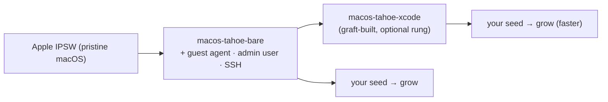

# graft — Seed Distribution & Base Images

> Working design doc (future epic — NOT in the "Sakura" GUI scope). Defines a distribution
> model where the **`.graft` seed is the unit you share, not the image**: everyone builds
> from a small set of authoritative **minimal base images** (one per macOS version), so a
> seed is a tiny, tweakable, version-controllable text file instead of a multi-GB artifact.
> Covers the tradeoffs (build time, reproducibility/pinning), how to produce a "pure fresh
> macOS" base (cirrus bases vs `tart create --from-ipsw`), a `graft sapling base` sketch,
> and a seed gallery. Marks **current** vs **target**. Seeds a Linear epic (GFT-TBD).

---

## 0. Design principles

1. **The seed is the source of truth; the image is derived.** graft already treats `.graft`
   as canonical (`grow` compiles it). Distribution should follow: share the recipe, build
   the image — never the reverse.
2. **Share text, not gigabytes.** A seed is kilobytes and diffable; an image is multi-GB and
   opaque. Sharing seeds makes recipes forkable and reviewable.
3. **One base ladder, owned and minimal.** Host the *smallest* useful set of base images
   (per macOS version), not a matrix of pre-baked variants. Variation lives in seeds.
4. **Reproducible by pinning, not by hope.** "Fresh macOS latest" drifts. Reproducibility
   comes from pinned base digests + pinned tool versions in the seed — not from the model
   itself.
5. **Build time is the cost; make it visible and amortizable.** Building from bare is slow.
   Don't hide it — give intermediate bases and caching so people opt into the depth they want.

---

## 1. Problem & motivation

Today graft *consumes* pre-baked images (mostly cirruslabs `-xcode` variants) and can *grow*
its own saplings from a seed. But the thing people would share is the **image** — large,
opaque, hard to tweak. The insight: **share the `.graft` seed instead.** Someone grabs the
seed they want (e.g. "RN + Detox e2e"), opens it in the builder, tweaks Node/Xcode/sims,
and grows it locally. The image is regenerated, never shipped.

For that to work, every seed needs a **common, authoritative base** to build `from:` — a
"super base" that's essentially a fresh macOS install of a given version (Tahoe, Sequoia, …).
That base is the linchpin of the whole model.

---

## 2. The model

- **Seed = unit of distribution.** Tiny text, forkable, reviewable, version-controlled.
- **A small base ladder, hosted by graft**, that seeds choose their starting rung on:



- **`bare`** = fresh macOS + the minimum to be graft-usable (see §4). The true "super base".
- **`xcode`** (optional) = a graft-built intermediate so the expensive Xcode/simulator layer
  isn't rebuilt on every grow. Seeds pick `from: …-bare` (slow, pure) or `from: …-xcode`
  (fast, common case).

### Tradeoffs (state them plainly)
- **Build time.** Cirrus ships `-xcode` precisely because Xcode + simulators from bare take
  30–90+ min. Pure-from-bare trades transfer size for build time. The ladder + local sapling
  cache + a hosted intermediate tame it.
- **Reproducibility.** Pin the base by digest and tool versions in the seed; otherwise the
  base drifts under you. The base images must be immutable/tagged.
- **You still host *something*** — one base per macOS version (+ maybe one intermediate),
  not zero. That's the deal: a little hosting for a lot of flexibility.

---

## 3. Producing a "pure fresh macOS" base

Two paths; the difference is the whole hard part.

### 3a. Use cirruslabs' minimal published images (easy; the starting point)
`ghcr.io/cirruslabs/macos-<version>-base` (macOS + Homebrew + Tart guest agent) and the
barer `-vanilla` variant are already "fresh + usable by graft." Point the base ladder at
these initially — **zero new infra**. Seeds `from: ghcr.io/cirruslabs/macos-tahoe-base`.

### 3b. Build our own from an IPSW (own the base; the epic)
`tart create --from-ipsw latest <name>` installs a pristine macOS from Apple's restore
image — *literally* nothing on it. That purity is also the problem: graft drives VMs via the
**Tart guest agent** + a known **`admin` user** + **SSH/auto-login**, none of which a raw
install has. So a usable base = fresh install **plus** a minimal first-boot layer:

1. `tart create --from-ipsw latest graft-tahoe-bare` (downloads IPSW ~15GB, installs ~20–30 min).
2. Automate the **Setup Assistant** (it's GUI — the genuinely hard step): create `admin`,
   set a known password, enable auto-login.
3. Enable **Remote Login (SSH)** + screen sharing.
4. Install the **Tart guest agent**.
5. `tart stop` → tag/push to `ghcr.io/briancorbin/macos-tahoe-bare`.

Step 2 is exactly what cirruslabs solved with **Packer templates** (`cirruslabs/macos-image-templates`). The realistic route is to reuse/adapt those rather than hand-roll Setup-Assistant automation.

---

## 4. What "graft-usable base" requires (the irreducible minimum)

A base is only useful to graft if it has: the **Tart guest agent** (for `tart exec`), an
**`admin` user with a known credential**, **auto-login**, and **SSH enabled**. That's the
thin layer between "pristine IPSW install" and "something graft can build on." Everything
else (brew, toolchains) belongs in seeds, not the base.

---

## 5. `graft sapling base` (sketch)

A new command family to build + publish bases (Phase B):

```
graft sapling base build --ipsw latest --macos tahoe   # IPSW → bare base (+ first-boot layer)
graft sapling base build --from <cirrus-base>          # adopt/re-tag an existing minimal base
graft sapling base publish <name> <ghcr-ref>           # push to graft's namespace
graft sapling base ladder                              # list the hosted base rungs
```

A seed's `from:` could also gain sugar: `from: graft:tahoe-bare` resolving to the hosted
base ref (so seeds aren't tied to a registry path). Pinning: `from: graft:tahoe-bare@sha256:…`.

---

## 6. Seed gallery

The distribution surface: a curated set of shareable seeds (RN-Detox, plain-Xcode-CI, …),
browsable + "grab & tweak" in the GUI's Seeds builder. Could be a git repo of `.graft`
files + a small index. GUI: "New from gallery" alongside "New from template." This is where
"share the file, not the image" actually lands for users. (Pairs with the builder + the
base-image **Inspect** already shipped in Sakura — inspect a base, see what a seed still
needs to add.)

---

## 7. Phasing

- **A — Adopt cirrus bases as the ladder.** Define `graft:<version>-bare`/`-xcode` aliases
  pointing at cirrus images; seeds + docs use them. No new infra; proves the model.
- **B — Own the base.** `graft sapling base build --ipsw` + first-boot automation (reuse
  cirrus Packer templates); publish graft's own bare bases to ghcr; `from: graft:…` resolution.
- **C — Intermediate rungs + caching.** A graft-built `-xcode` intermediate; local sapling
  cache + optional registry cache so repeated grows are fast.
- **D — Seed gallery.** Curated shareable seeds + "New from gallery" in the builder.

---

## 8. Open questions

1. **How thin can `bare` be** and still serve every seed? (Guest agent + admin + SSH is the
   floor — anything else?)
2. **Reproducibility policy** — do we *require* digest-pinned `from:` for shared seeds, or
   just recommend it?
3. **Base refresh cadence** — bases need rebuilding for macOS point releases / security
   updates. Who/what triggers it? (Ties to the autoscaling/scheduling thinking.)
4. **Registry + cost** — ghcr under `briancorbin/` or an org? Bandwidth for multi-GB bases.
5. **Setup-Assistant automation** — adopt cirrus Packer templates wholesale, or a leaner
   graft-native first-boot script? (Packer is a dep we've otherwise avoided.)
6. **`from: graft:…` resolution** — static map, or a small manifest the CLI fetches?

---

## 9. Backlog (to seed in Linear — GFT-TBD)

- Epic: **Seed distribution & base images** (this doc).
- Define the base ladder + `graft:<version>-bare/-xcode` aliases over cirrus images (Phase A).
- `graft sapling base build --ipsw` + first-boot automation (Phase B).
- Publish graft-owned bases to ghcr; `from: graft:…` resolution + digest pinning (Phase B).
- Hosted `-xcode` intermediate + sapling caching (Phase C).
- Seed gallery + "New from gallery" in the builder (Phase D).
- Docs: the share-the-seed-not-the-image model + pinning guidance.
